# Simple Escrow dApp — Blockchain Project 2 & 3

## Deskripsi

**Simple Escrow** adalah dApp (decentralized application) layanan escrow untuk transaksi aman antara dua pihak (buyer dan seller) di atas blockchain Ethereum. Dana buyer dikunci di smart contract hingga buyer mengonfirmasi penerimaan barang/jasa. Jika terjadi sengketa, arbiter berwenang memutuskan alokasi dana.

Contract mengimplementasikan **state machine** dengan 4 state:

```
AWAITING_DELIVERY → COMPLETE   (buyer release)
AWAITING_DELIVERY → DISPUTED   (buyer dispute)
AWAITING_DELIVERY → REFUNDED   (timeout / arbiter ruled buyer wins)
DISPUTED          → COMPLETE   (arbiter ruled seller wins)
DISPUTED          → REFUNDED   (arbiter ruled buyer wins)
```

## Anggota Kelompok

| Nama | NRP | Kontribusi |
|------|-----|------------|
| Danar Bagus Rasendriya | 5027231055 | Smart Contract, Frontend, Integrasi Web3 |
| Diandra Naufal Abror | 5027231004 | Frontend UI/UX, Dokumentasi |
| Tio Axellino Irin | 5027231065 | Integrasi Web3, Testing |

## Tech Stack

- **Frontend:** React + Vite + Tailwind CSS
- **Smart Contract:** Solidity ^0.8.20 + Hardhat ^2.22.0
- **Web3 Library:** ethers.js v6
- **Wallet:** MetaMask
- **Styling:** Dark Minimalism + Glassmorphism (Obsidian theme)

## Fitur

### Smart Contract (Project 2)

- ✅ Buyer deposit dana — buyer mengirim ETH ke contract saat memulai transaksi
- ✅ Buyer release dana — buyer mengonfirmasi penerimaan dan merilis dana ke seller
- ✅ Buyer raise dispute — buyer mengajukan sengketa jika tidak puas
- ✅ Refund mechanism — dana dikembalikan ke buyer jika sengketa dimenangkan buyer
- ✅ Arbiter untuk dispute — pihak ketiga netral menyelesaikan sengketa dengan arbiter fee
- ✅ Timeout auto-refund — buyer bisa request refund otomatis setelah deadline

### Frontend dApp (Project 3)

- [x] Connect Wallet — deteksi MetaMask, request koneksi, tampilkan address
- [x] Network Detection — deteksi chain ID, warning jika salah network, tombol switch
- [x] Account Display — tampilkan address + role badge (Buyer/Seller/Arbiter/Viewer)
- [x] Read: Escrow Details — buyer, seller, arbiter, amount, deadline, state, arbiter fee
- [x] Read: Contract Balance — saldo ETH yang terkunci di escrow
- [x] Read: Expiry Check — cek apakah deadline sudah terlewati
- [x] Write: Deposit — buyer deposit ETH via MetaMask
- [x] Write: Release Funds — buyer release dana ke seller
- [x] Write: Raise Dispute — buyer ajukan sengketa
- [x] Write: Refund After Timeout — buyer refund setelah deadline
- [x] Write: Resolve Dispute — arbiter menyelesaikan sengketa
- [x] Transaction Feedback — status pending/success/failed dengan toast
- [x] Error Handling — pesan error user-friendly dalam Bahasa Indonesia
- [x] Responsive Design — desktop 2-kolom, mobile 1-kolom
- [x] Role-based Actions — tombol aksi muncul sesuai role + state

## Struktur Project

```text
Escrow-dApp/
├── contracts/
│   ├── EscrowFactory.sol             # Contract deployer & tracking mapping
│   ├── SimpleEscrow.sol              # Smart contract utama (state machine)
│   └── Rejector.sol                  # Helper contract untuk pengujian kegagalan transfer
├── test/
│   ├── EscrowFactory.test.js          # Unit tests untuk EscrowFactory
│   └── SimpleEscrow.test.js           # Unit tests untuk SimpleEscrow (63 test)
├── scripts/
│   ├── deploy.js                     # Script deployment otomatis ke local & Sepolia
│   └── interact.js                   # Script interaksi demo CLI
├── screenshots/                      # Hasil tangkapan layar antarmuka dApp
│   ├── wallet-not-connected.png      # Tampilan Landing Page (wallet disconnected)
│   ├── wallet-connected.png          # Tampilan Dashboard Utama (wallet connected)
│   └── mobile-view.png               # Tampilan Mobile Responsive
├── frontend/
│   ├── src/
│   │   ├── components/
│   │   │   ├── ConnectWallet.jsx     # Header, wallet connection, & deteksi network
│   │   │   ├── CreateEscrowForm.jsx  # Form buat escrow (opsi menit, jam, hari)
│   │   │   ├── EscrowDetail.jsx      # Panel detail transaksi & timeline aksi
│   │   │   └── EscrowList.jsx        # Daftar transaksi & filter data (shimmer loader)
│   │   ├── hooks/
│   │   │   ├── useWallet.js          # State wallet & event listener MetaMask
│   │   │   └── useContract.js        # Fungsi baca & tulis ke smart contract
│   │   ├── utils/
│   │   │   └── contracts.json        # Penyimpan ABI & Alamat Factory aktif
│   │   ├── App.css                   # Layout global & styling animasi
│   │   ├── App.jsx                   # Main layout & pembagian kolom UI
│   │   ├── index.css                 # Desain sistem Glassmorphism + HSL tokens
│   │   └── main.jsx                  # React entrypoint
│   ├── index.html
│   ├── tailwind.config.js
│   ├── package.json
│   └── vite.config.js
├── hardhat.config.js
├── package.json
└── README.md
```

## Cara Menjalankan

### Prerequisites

- Node.js v18+
- npm
- MetaMask browser extension
- Git

### 1. Clone & Install Root (Smart Contract)

```bash
git clone <url-repo>
cd Escrow-dApp
npm install
```

### 2. Compile Smart Contract

```bash
npx hardhat compile
```

### 3. Test Smart Contract

```bash
npx hardhat test
```

### 4. Jalankan Local Blockchain

Terminal 1 — jalankan Hardhat node (biarkan berjalan):

```bash
npx hardhat node
```

*Catatan: Import minimal 3 private key pertama dari Hardhat node ke MetaMask Anda.*

### 5. Deploy Smart Contract ke Localhost

Terminal 2 — deploy contract:

```bash
npx hardhat run scripts/deploy.js --network localhost
```

*Catatan: Alamat kontrak otomatis terupdate di `contracts.json`.*

### 6. Install Frontend Dependencies

```bash
cd frontend
npm install
```

### 7. Import Akun ke MetaMask

1. Buka MetaMask → klik dropdown network → **Add a network manually**
2. Isi:
   - Network Name: `Hardhat Local`
   - RPC URL: `http://127.0.0.1:8545`
   - Chain ID: `31337`
   - Currency Symbol: `ETH`
3. Import 3 akun menggunakan private key dari output `npx hardhat node`:
   - Account #0 → Buyer
   - Account #1 → Seller
   - Account #2 → Arbiter

### 8. Jalankan Frontend

```bash
# Di folder frontend/
npm run dev
```

Buka browser: **http://localhost:5173**

### 9. Interaksi dengan dApp

1. Connect wallet dari Account #0 (Buyer) → akan tampil role badge "Buyer"
2. Tombol "Deposit Funds" muncul → masukkan jumlah ETH dan submit
3. Setelah deposit sukses, tombol "Release Funds", "Raise Dispute", "Refund" muncul
4. Switch ke Account #1 (Seller) → hanya bisa melihat status (read-only)
5. Switch ke Account #2 (Arbiter) → tombol resolve muncul saat state DISPUTED
6. Semua status transaksi ditampilkan via toast di bagian bawah layar

---

## Alamat Kontrak Ter-deploy

| Network | Chain ID | Kontrak | Alamat Kontrak | Link Explorer |
|---------|----------|---------|----------------|---------------|
| **Hardhat Localhost** | 31337 | `EscrowFactory` | `0x5FbDB2315678afecb367f032d93F642f64180aa3` | - |
| **Sepolia Testnet** | 11155111 | `EscrowFactory` | `0x8509b207770b4fe56eB671cB37E493eC81ED354f` | [Etherscan Sepolia](https://sepolia.etherscan.io/address/0x8509b207770b4fe56eB671cB37E493eC81ED354f#code) |

---

## Spesifikasi Kontrak Pintar

| Komponen | Detail |
|---|---|
| State Variables | `buyer`, `seller`, `arbiter`, `depositAmount`, `currentState`, `deadline`, `arbiterFeePercent` |
| Functions | `deposit()`, `releaseFunds()`, `raiseDispute()`, `refundAfterTimeout()`, `resolveDispute()`, `getBalance()`, `isExpired()`, `getEscrowDetails()` |
| Modifiers | `onlyBuyer`, `onlyArbiter`, `inState` |
| Events | `Deposited`, `FundsReleased`, `DisputeRaised`, `Refunded`, `DisputeResolved` |

---

## Dokumentasi Pengerjaan & Hasil Pengujian

### 1. Hasil Unit Testing (63/63 Lulus)
Pengujian logika kontrak dijalankan menggunakan Hardhat test dengan total 63 test case:

```text
  EscrowFactory
    Deployment
      ✓ should initialize escrowCount as zero
      ✓ should return empty array for user who has no escrows
    createEscrow()
      ✓ should increment escrowCount
      ✓ should store escrow address in allEscrows array
      ...
  SimpleEscrow
    Deployment
      ✓ should set correct buyer (deployer)
      ...
    deposit()
      ✓ should allow buyer to deposit ETH
      ...
    releaseFunds()
      ✓ should transfer full deposit to seller
      ...
    raiseDispute()
      ...
    resolveDispute()
      ...
    refundAfterTimeout()
      ...

  63 passing (6s)
```

### 2. Hasil Pengujian Coverage Kontrak (100% Statement Coverage)
Pengujian coverage menggunakan plugin `solidity-coverage`:

```text
--------------------|----------|----------|----------|----------|----------------|
File                |  % Stmts | % Branch |  % Funcs |  % Lines |Uncovered Lines |
--------------------|----------|----------|----------|----------|----------------|
 contracts\         |      100 |    86.76 |      100 |      100 |                |
  EscrowFactory.sol |      100 |      100 |      100 |      100 |                |
  Rejector.sol      |      100 |      100 |      100 |      100 |                |
  SimpleEscrow.sol  |      100 |    86.36 |      100 |      100 |                |
--------------------|----------|----------|----------|----------|----------------|
All files           |      100 |    86.76 |      100 |      100 |                |
--------------------|----------|----------|----------|----------|----------------|
```

---

## Screenshot & Bukti Tampilan Skenario Alur Kerja

Berikut adalah tangkapan layar antarmuka dApp untuk setiap skenario alur kerja transaksi:

> 💡 **Catatan untuk Demo:** Tempatkan screenshot hasil uji coba Anda ke dalam folder `screenshots/` dengan nama file yang sesuai agar otomatis ter-render pada dokumen ini.

### 1. Koneksi Wallet & Landing Page

#### **A. Tampilan Landing Page (Wallet Terputus)**
Tampilan awal saat wallet MetaMask belum terhubung.

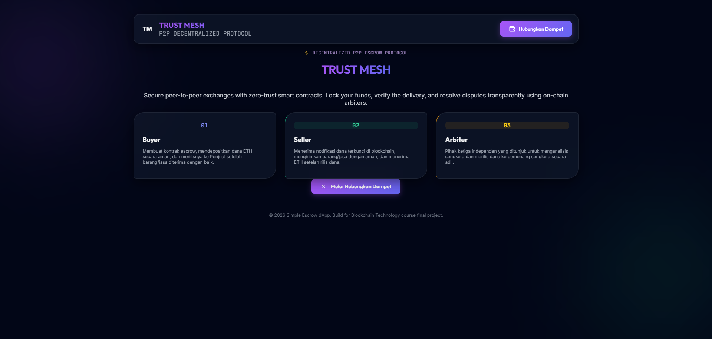

#### **B. Dashboard Utama (Wallet Terhubung)**
Tampilan utama dashboard setelah wallet berhasil terhubung.

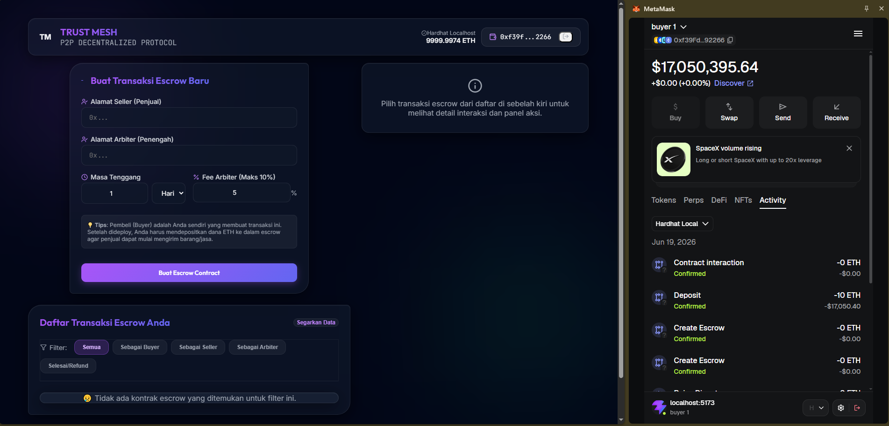

---

### 2. Pembuatan & Detail Kontrak

#### **A. Konsol Pembuatan Escrow Baru**
Form untuk memasukkan parameter escrow baru.

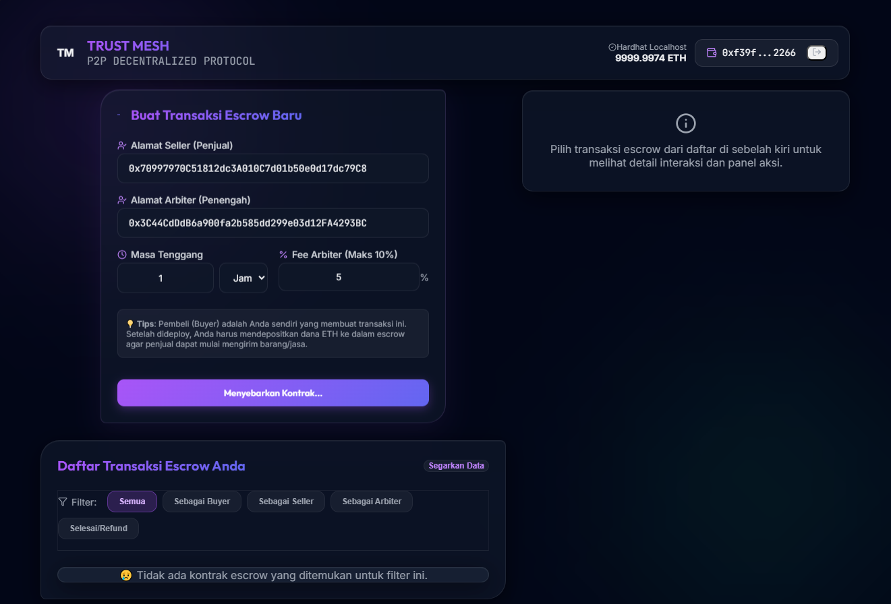

#### **B. Konfirmasi Pembuatan Kontrak Baru di MetaMask**
Konfirmasi transaksi factory deployment melalui MetaMask.

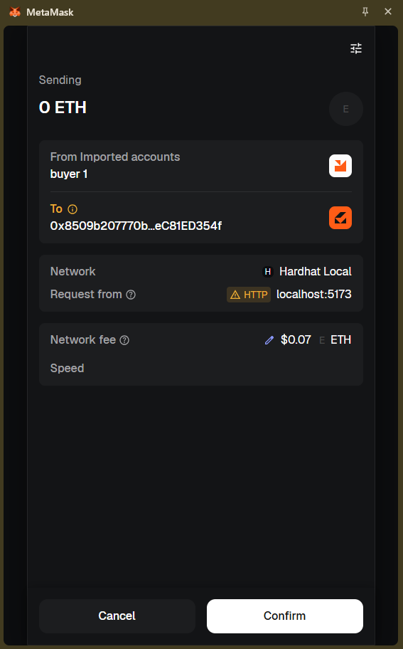

#### **C. Panel Detail & Status On-chain**
Tampilan rincian parameter escrow dan status on-chain.

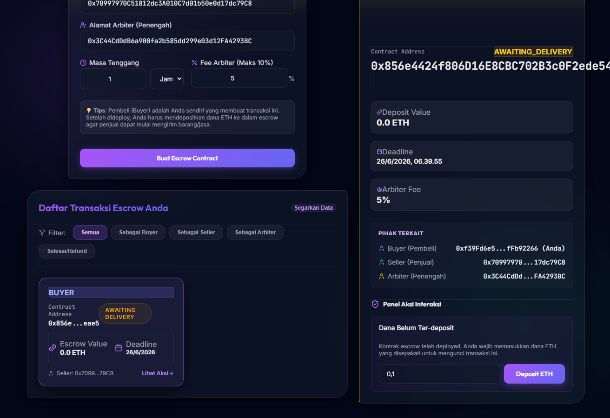

---

### 3. Transaksi Berhasil & Peran Seller

#### **A. Konfirmasi Deposit Sukses (Status Awaiting Delivery)**
Tampilan status transaksi setelah Buyer melakukan deposit dana.

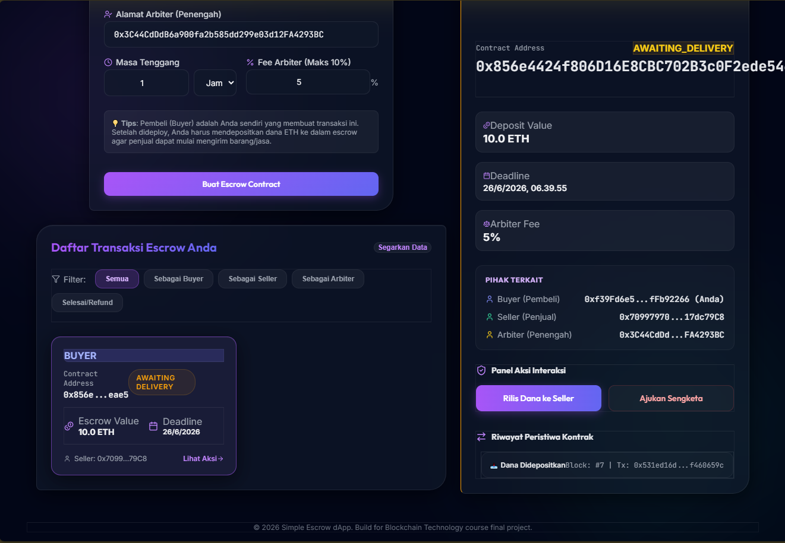

#### **B. Lacak Riwayat Aktivitas Transaksi di MetaMask**
Daftar transaksi yang berhasil dieksekusi pada riwayat MetaMask.

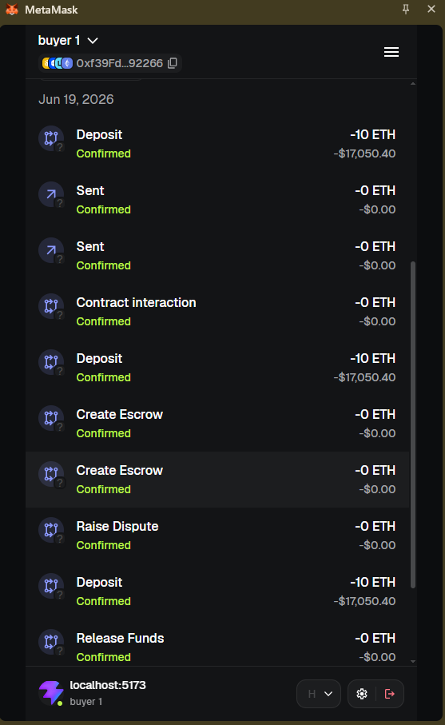

#### **C. Tampilan Dashboard dari Sisi Seller (Read-Only)**
Tampilan antarmuka saat terhubung sebagai Seller (hanya menampilkan status).

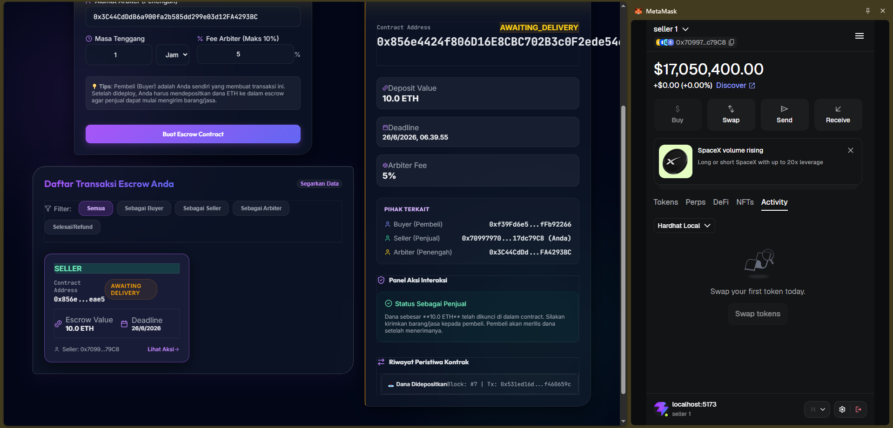

---

### 4. Sengketa & Resolusi Arbiter (Dispute Path)

#### **A. Kontrak dalam Status Sengketa (Disputed State)**
Tampilan saat transaksi ditandai sengketa oleh Buyer.

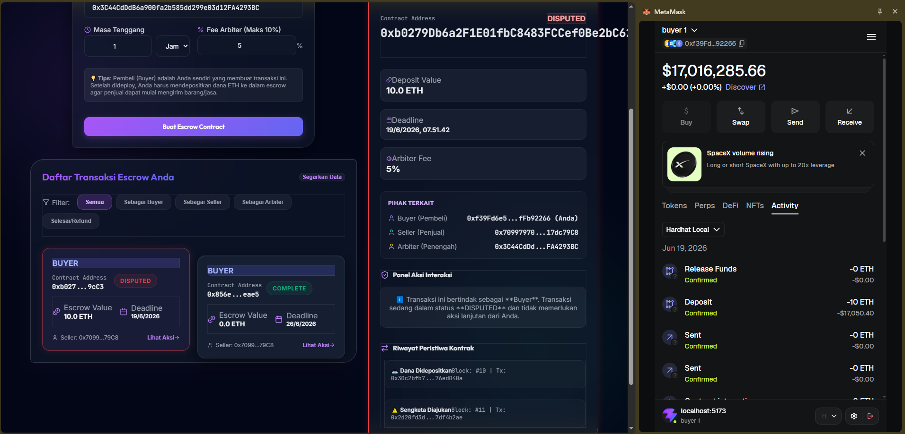

#### **B. Panel Keputusan Sengketa (Arbiter View)**
Pilihan keputusan sengketa yang hanya muncul ketika terhubung sebagai akun Arbiter.

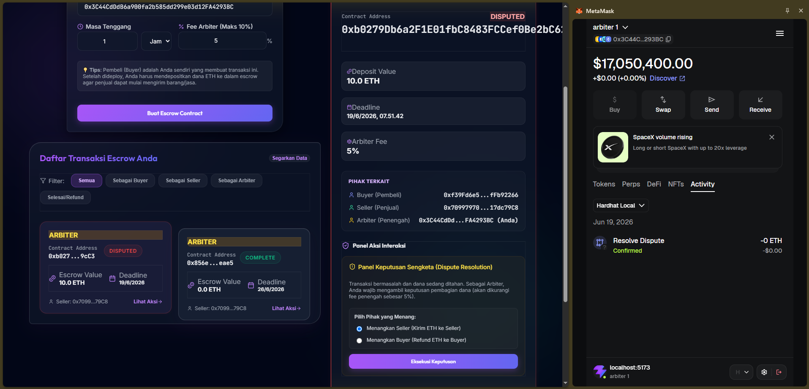

---

### 5. Optimasi Mobile Responsive
Tampilan antarmuka yang responsif pada layar handphone/mobile.

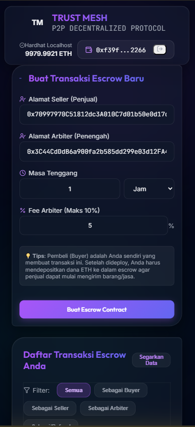

---

## Fitur Bonus (Telah Dicapai)

- [x] **Event Listening** — Sinkronisasi real-time UI saat terdeteksi event blockchain tanpa perlu refresh halaman web.
- [x] **Transaction History** — Menampilkan riwayat aksi log transaksi (Deposited, Released, Disputed, dll.) di bagian timeline detail.
- [x] **Deploy ke Sepolia Testnet** — Ter-deploy dan terverifikasi secara publik di blockchain Etherscan Sepolia.
- [x] **Loading Skeleton Shimmer** — Efek placeholder berkilau saat memuat daftar escrow card.
- [ ] **Frontend Hosting**

*Total bonus poin yang berhasil dicapai: +10 Poin.*

